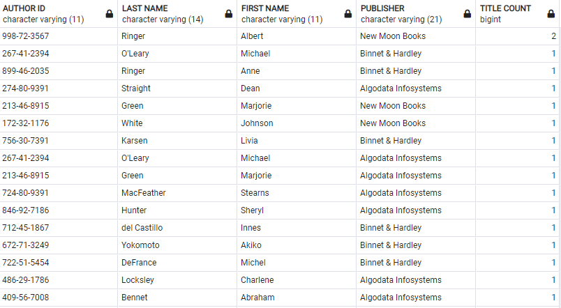
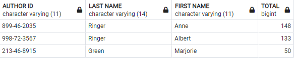

# Lab | PostgreSQL Select

## Introduction
In this lab you will practice `SELECT` statement which will be extremely useful in your future work as a data analyst/scientist/engineer.  
- Use code from `publications_database.sql` to create your databese, tables and insert data. 
  
**1. Who have published what at where?**

In this challenge you will write a PostgreSQL `SELECT` query that `JOIN` various tables to figure out what titles each author has published at which publishers.   
Your output should have at least the following columns:  
From `authors` table:  
- `au_id` - the ID of the author.
- `au_lname` - author last name. 
- `au_fname` - author first name.   

From `titles` table:  
- `title` - name of the published title.  

From `publishers` table:  
- `pub_name` - name of the publisher where the title was published.

Your output will look something like below:

*Note: the screenshot above is not the complete output.*

If your query is correct, the total rows in your output should be the same as the total number of records in table `titleauthor`.

**2. Who have published how many at where?**

Elevating from your solution in challenge 1, query how many titles each author has published at each publisher. Order your output by the title count in descending order.  

Your output should look something like below:

*Note: the screenshot above is not the complete output.*  

To check if your output is correct, sum up the `TITLE COUNT` column. The sum number should be the same as the total number of records in Table `titleauthor`.  

*Hint: In order to count the number of titles published by an author, you need to use [COUNT](https://www.w3resource.com/PostgreSQL/postgresql-count-function.php).  Also check out [GROUP BY](https://www.w3resource.com/PostgreSQL/postgresql-group-by.php) because you will count the rows of different groups of data.*

**3. Best Selling Authors**

Who are the top 3 authors who have sold the highest number of titles?   
Your output should have at least the following columns:  

From `authors` table:  
- `au_id` - the ID of the author.
- `au_lname` - author last name. 
- `au_fname` - author first name. 
  
From `sales` table:
- `qty` - quantity
  
Your output should be ordered based on `TOTAL` from high to low.  
Only output the top 3 best selling authors.

Your output should look something like below:

**4. Best selling authors ranking**

Now modify your solution in challenge 3 so that the output will display all 23 authors instead of the top 3.  Note that the authors who have sold 0 titles should also appear in your output, ideally display `0` instead of `NULL`.   
Also order your results based on `TOTAL` from high to low. 

Your output should look something like below:

