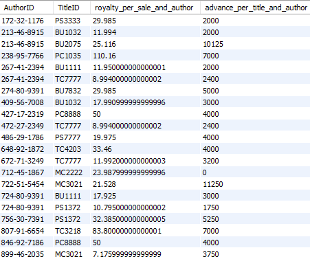
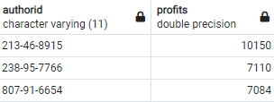

# Lab | Advanced mySQL 

## Introduction

In this lab you will practice mySQL subqueries and temporary tables.  
- Use the same database from the lab `mySQL_select`. If you are starting now, use the code from `publications_database.sql` to create your databese, tables and insert data. 

**1. Most profiting authors**

In this challenge you'll find out *who are the top 3 most profiting authors* in the `publications_database`.   

*It is possible to solve this exercise using one query, to do that you will need to use subqueries. We strongly recommend follow the steps below.*  

We will split this challenge in 3 steps:


**Step 1: Calculate the `royalty of each sale for each author` and the `advance for each author and publication`.**

Write a `SELECT` query to obtain the following columns:

- `titleauthor.au_id `. Rename this field as AuthorID
- `sales.title_id`. Rename this field as TitleID
- Royalty of each sale. Rename this field as `royalty_per_sale` Use the formula:
    ```
    titles.price * sales.qty * (titles.royalty / 100) * (titleauthor.royaltyper / 100)
    ```
- Advance of each title and author. Rename this field as `advance_per_title_and_author`. Use the formula: 
    ```
    titles.advance * (titleauthor.royaltyper / 100)
    ```
- Note that `titles.royalty` and `titleauthor.royaltyper` are divided by 100 respectively because they are percentage numbers instead of floats.

*Note: In the output of this step, each title may appear more than once for each author. This is because a title can have more than one sale.*

Your output should look something like below:


After your solution use the query to create a temporary table called `step1_royalties`.


**Step 2: Aggregate the total royalties for each title and author.**

Using the temporary table from Step 1, write a query to obtain the following output:

- AuthorID
- TitleID
- SUM of royalty_per_sale
- advance_per_title_and_author
  
 Hint: To use the *SUM* you should *GROUP BY* `AuthorID` and `TitleID`.

*Note: In the output of this step, each title should appear only once for each author.*  


Your output should look something like below:



After your solution use the query to create a temporary table called `step2_royalties`.


**Step 3: Calculate the total profits of each author.**

Now that each title has exactly one row for each author where the advance and royalties are available, we are ready to obtain the eventual output. Using the temporary table from Step 2, write a query that contains the following output:

- Author ID
- SUM of profits of each author aggregating by `royalty_per_sale_and_author` and `advance_per_title_and_author`.

Sort the output based on a total profits from high to low, and limit the number of rows to 3.


Your output should look something like below:




**2. Alternative solution**

In the previous challenge, you have developed your solution creating temporary tables and query the temporary tables in the subsequent steps.
We'd like you to try using subqueries. you can check a documentation [here](https://dev.mysql.com/doc/refman/8.0/en/derived-tables.html)


